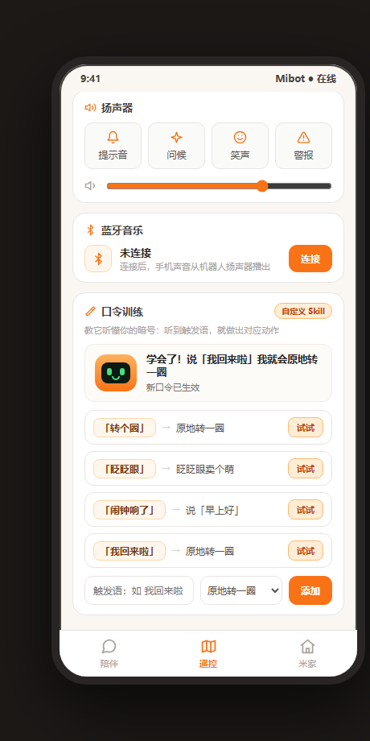
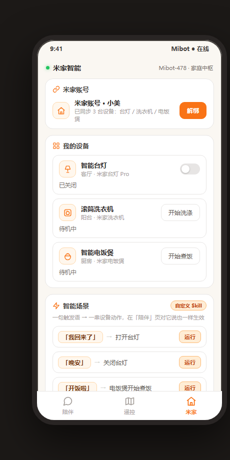
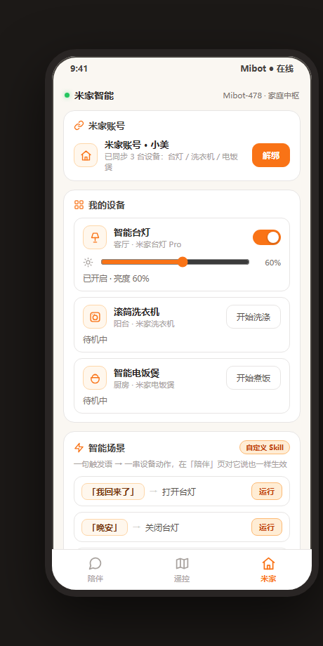

# 2026 首届 openvela AI 硬件开发者大赛·文档

**产品定义：**
一台能移动、会表达、能主动陪伴的桌面 AI 宠物机器人：

同一个宠物有两种存在形态，现实形态是家里的实体桌宠，虚拟形态是手机上的虚拟宠物；

让用户在家有实体陪伴，出门有虚拟陪伴。

- 团队名称：支持米家配队（编号 478）

- 团队成员：@崔美玉@张泽琦@孟繁帆@朱雨珊@苏晗瑞

- 项目源码与 AI Coding 日志均在赛事分配的专属仓`contest2026_478_zhichimijiapeidui` 内，无需放入压缩包；评审将直接 clone 该仓库编译运行验证。

- **提交方式**：将提交材料打包为一个压缩包并在官网上传，命名格式为 `<队伍名称>-<作品名称>-<仓库名称>.zip`，本作品即 `支持米家配队-Mibot-contest2026_478_zhichimijiapeidui.zip`。

# **一、Mibot 介绍与外观展示**

## **实体整机外观展示**

- Mibot 整机为桌面宠物形态，采用 8mm 模数的积木式三层仓体结构（本体外廓 88×64mm、总高约 89\.6mm，含包边围框与层间互锁隔板；长宽按 \+8mm/单位、高度按 \+3\.2mm/板扩展，元件尺寸变化时外观可快速重构）。自下而上为：电池仓（66\.73×36\.59mm 电池 \+ 21\.26×18\.36mm 充电模块，USB 口朝后墙开孔）、主板仓（57\.19×28\.29mm 主控板）、显示仓（65\.27×38mm LCD 驱动板 \+ 35\.13×41\.65mm 表情屏，前墙开窗）。

- 正面 LCD 屏即"脸"，显示眼睛与表情；左右两台 54\.38×39\.98mm 电机外挂两侧墙、兼作手臂座，各带动一条 38\.78×11\.20mm 旋转手臂，可挥手、摆动、做小动作。

- 四视图看点：前视图看表情屏前脸与双臂布局；后视图看 USB 充电口开孔与包边围框；侧视图看三层仓体的分层与厚度分布；俯视图看顶部结构与整体包边。

【提交前插入整机实拍照片：前视图 / 后视图 / 侧视图 / 俯视图】

## **虚拟形象展示**

「Mibot · 虚拟形态」是实体桌宠的手机端镜像：同一个宠物，在家是实体、出门在兜里。交付物为单文件可交互原型 `mibot-虚拟形态.html`（零外部依赖，双击即玩，演示视频中含操作实拍），与实体机共享同一套人格、表情与记忆设计，共「陪伴 / 遥控 / 米家」三页。逐功能的使用场景、触发条件与实现效果如下：

|**页面**|功能|使用场景与触发条件|APP实现效果|
|---|---|---|---|
|**陪伴**<br><br>|文字对话|日常闲聊、倾诉；在输入框发送任意消息|LLM 人格化回复；说"我叫小美"→ 写入长期记忆，说"我今天好累"→ 切换安慰表情并记住这件事，说"晚安"→ 道晚安（绑定米家后还会自动执行「晚安」场景关灯）|
||表情联动|想让宠物有情绪反馈时；随对话语义自动触发，或点"夸夸它 / 求安慰 / 哄睡"快捷动作|11 种表情实时切换（开心/难过/疑惑/打招呼/思考/提醒/困倦/喜欢/惊讶/聆听/平静）\+ 弹跳小动作，与实体机 LCD 表情同一套设计|
||长期记忆|对话中说出名字、喜好等重要事实时自动触发|自动去重记住；右上角"记忆"抽屉可查看/删除；断电重启不丢（对应实体机 NVS 长记忆）|
||主动陪伴|无人说话、静默约 18 秒时自动触发|主动弹气泡开口关怀（"坐久啦，起来倒杯水活动一下？"等），对应大赛要求的"主动 \+ 执行"场景|
||米家语音入口|已绑定米家后，直接说"打开台灯 / 关灯 / 洗衣服 / 煮饭"|真正控制米家页设备，回复带 ⚡ 执行标签，形成"对话 → 执行"闭环|
|**遥控**<br>|家庭建图|机器人初到家、需要认识房间布局时；点"开始建图"|雷达扫描动画 \+ 进度 → 识别出卧室/厨房/书房/客厅与充电座；点任意房间，机器人圆点平滑移动前往，状态实时显示"正在前往 → 已到达"|
||回充 / 重扫|电量低或布局变化时；点"回充电座"或"重新扫描"|机器人回到充电座，或重新执行一轮建图|
||扬声器|想让机器人发声提醒或互动时；点音效按钮、拖音量滑条|播放提示音/问候/笑声/警报 4 种音效，音量实时调节（对应实体机扬声器播放 TTS 与提示音）|
||蓝牙音乐|把手机音乐推给机器人当蓝牙音箱时；点"连接"→ 搜索 → 发现 Mibot\-478 → 点设备配对|完整配对状态机（搜索中→已发现→已连接）；连接后出现播放器：3 首曲目循环、播放/暂停/切歌、进度条点按跳转，律动条随音乐跳动|
||口令训练（自定义 Skill）|想教机器人专属口令时；输入触发语 \+ 选动作后点"添加"，或点已有口令右侧"试试"|小机器人立即表演：「转个圈」原地转圈、「眨眨眼」眨眼卖萌、「闹钟响了」播放提示音并说早上好；预置 3 条，可无限自建|
|**米家**<br>|账号绑定|首次使用米家控制前；点"绑定"|跳转授权 → 同步设备 → 已绑定，自动同步台灯/洗衣机/电饭煲 3 台设备；未绑定时设备区与场景区锁定|
||智能台灯|开关灯、调节亮度；点 toggle 或拖亮度滑条|实时开关 \+ 亮度 10–100% 调节，状态行显示"已开启 · 亮度 60%"|
||滚筒洗衣机|出门前远程启动洗衣；点"开始洗涤"|剩余分钟倒计时（演示加速）→ 完成时叮声提醒"记得晾衣服哦"|
||智能电饭煲|回家前提前预约煮饭；点"开始煮饭"|煮饭倒计时 → 自动转入"保温中"|
||智能场景（自定义 Skill）|一句话联动多台设备；点场景右侧"运行"，或在陪伴页直接说出触发语|逐步执行并显示"执行中：打开台灯…"→"执行完成 ✓"；预置「我回来了」「晚安」「开饭啦」「出门啦」4 个场景，也可输入触发语 \+ 选动作自建新场景|

- 「Mibot · 虚拟形态」是实体桌宠的手机端镜像，用三页覆盖了"情感陪伴—物理移动—家庭控制"三层体验：

陪伴页是核心，文字对话搭配 11 种实时表情和断电不丢的长期记忆，18 秒静默后还会主动开口关怀，把"它记得我、它会想我"做成了差异化亮点；

遥控页让宠物动起来。家庭建图后点图巡航、扬声器互动、蓝牙配对秒变音箱，再加上可自建的口令训练，把机器人能力玩出了养成感；

米家页则把宠物升级成家中枢，绑定账号后台灯、洗衣机、电饭煲随手可控，智能场景一句话联动多设备，还能直接在陪伴页聊天里语音触发，形成"对话即执行"的闭环。三页合起来，同一个宠物在家是实体、出门在兜里，陪伴不断线。

- 移动端扫码体验：








## **海报展示**

一图流海报汇总 Mibot 全貌：产品定位（桌面 AI 宠物机器人 · 实体 \+ 虚拟双形态陪伴）、核心功能（语音对话 / 表情动作 / 长期记忆 / 主动关怀 / 米家联动）、三岛技术架构（SF32LB52 实时 I/O 岛 \+ ESP32\-S3 AI 大脑岛 \+ PC 音频网关）与典型使用场景，帮助评委快速建立整体认识。

【提交前插入一图流海报】


## **视频展示**

「Mibot · 虚拟形态」是实体桌宠的手机端镜像，功能展示视频如下：

[20260920142929\_rec\_\.mp4](图片和附件/20260920142929_rec_.mp4)

演示视频按真实使用流程实拍：实体机语音唤醒对话（LCD 表情实时反馈）→ 主动关怀提醒触发 → App「遥控」页家庭建图与点位移动、口令训练表演 →「米家」页绑定账号并执行「晚安」场景 →「陪伴」页用对话直接控制台灯，完整覆盖"对话、记忆、主动、执行"四个演示点。

【提交前插入演示视频】

# **二、Mibot 技术报告**

## **1、信息表**

|项目|内容|
|---|---|
|作品名称|Mibot · 会记住你的 AI 积木桌宠机器人|
|队伍名称|支持米家配队|
|团队分工|见下表|
|选题方向|AI 硬件产品创新|
|团队编号|478|
|作品仓库|`contest2026_478_zhichimijiapeidui`（大赛专属仓，含项目源码与 AI Coding 日志）|

|成员|分工|
|---|---|
|崔美玉|系统架构、报告统稿、结构外观适配|
|朱雨珊|方案选型、应用设计、交互流程、视频剪辑|
|孟繁帆|openvela AI 能力落地、自定义 Skill 设计、云端架构|
|张泽琦|AI 算法、板间与网络通信、性能测试|
|苏晗瑞|硬件设计、屏幕交互方案、性能指标|

## **2、摘要**

**Mibot 是一款****有记忆、能回应****的陪伴型桌宠机器人。它通过眼神、动作、灯光和简短对话提供实体存在感，并以专注、提醒和陪伴形成长期日用价值。**

同一个宠物有两种存在形态：

- 现实形态是家里的**实体桌宠**

- 虚拟形态是手机上的**虚拟宠物 App**


**产品Slogan：如果可以，我希望你不再一个人**

- **双板架构与职责**
采用 SF32LB52（openvela）\+ ESP32\-S3 双板架构：openvela 负责音频采集、播放和 LCD 表情，ESP32\-S3 运行 piagent、连接 MiMo 大模型，并支持短时与持久化长时记忆。

- **语音识别与通信可靠性**
使用本地 sherpa\-onnx 中文模型，实现零云端 Key 成本；语音识别测试连续通过，4\.8 秒语音可准确识别。板间采用 1Mbps 自定义协议，并通过应用层重发机制容错。

- **问题修复与工程沉淀**
修复 openvela 音频驱动冷启动导致的麦克风低电平问题，使本底峰值由 18 提升至 110；同时沉淀 2 个自定义 Agent Skill，并形成可模块化扩展的积木式结构设计。

## **3、正文**

## **3\.1 绪论**

### 3\.1\.1 项目背景与问题定义

**（1）项目背景**

**结论：面向 C 端消费者的“AI 陪伴型桌宠”是一片尚未被充分满足的蓝海市场**

|判断|证据方向|对产品的含义|
|---|---|---|
|市场基数|独居/一人生活、长时间桌面工作、年轻人情绪消费和 AI 尝鲜叠加|“池子够大” ✅|
|用户需求|用户需要情绪出口、专注提醒、轻量互动、可持续养成|“有人要买” ✅|
|供给空白|实体桌宠有在场感但智能与记忆弱；AI App 智能但无实体；音箱实用但关系弱|“卖的不是他们想要的” ✅|

**1）市场基数——“池子够大” ✅**

- 需要工作学习的人群基数大：高频使用桌面工作与学习场景

- 高压人群情绪消费与陪伴经济正在扩大：桌宠的直接市场规模暂时难以独立统计，但其需求来源与多个成熟市场重叠：**宠物经济**提供了情感投射和陪伴消费的外部需求池。用户愿意为“被需要、被回应、拥有专属关系”支付，只是部分人受限于房屋、工作、时间、过敏或长期责任而无法养真实宠物；**情绪消费**让“治愈、仪式感、可爱、解压、陪伴”从附加价值变成购买理由。香薰、盲盒、毛绒、收藏、桌面摆件和疗愈内容都在争夺同一类情绪预算。

- 消费者愿意为“情绪玩具”的购买趋势：实体桌宠的支付意愿可以从相邻品类获得验证，而不是只看传统电子宠物：

    - **养成系**：电子宠物和光与夜之恋养成类产品证明，用户愿意为持续关系和成长循环付费。

    - **潮玩玩具**：泡泡玛特盲盒、玲娜贝儿IP周边和捏捏等桌面摆件证明，外观、稀缺性和身份表达可以形成溢价。

    - **硬件**：高端耳机、键盘、游戏设备和智能硬件证明，年轻用户愿意为桌面体验和个性化投入预算。

    - **桌宠类成熟产品**：EMO、Loona、Eilik 等实体产品证明，用户愿意尝试“会动、会回应、可以放在桌上”的新形态；同时其用户反馈也提示，长期留存不能只依靠动作和外观。

    - **AI聊天**：**生成式 AI 普及**降低了用户理解和接受“可对话角色”的门槛。用户开始期待产品记住偏好、拥有性格并能进行连续互动，但纯数字产品仍缺少实体在场感。

**2）用户需求——“有人要买” ✅**

- 独居和高压人群需要低压力情绪出口

    独居、远程办公、异地生活以及持续高压工作，使不少用户在回家后或深夜出现一种典型状态：**有表达欲，但没有足够精力组织一次完整社交；希望获得回应，又不想承担维系关系、解释情绪或即时回复的压力。**

    |    高频触发场景|    用户当下的真实任务|    现有替代方式|    尚未被满足的部分|
    |---|---|---|---|
    |    下班或放学后独处|    从高压状态中缓慢退出|    刷短视频、听音乐、与朋友聊天|    屏幕刺激强；真人社交需要组织语言和等待反馈|
    |    深夜情绪波动|    说出当下感受并获得即时回应|    AI 聊天、社交平台、日记|    纯数字互动缺少实体在场；公开表达存在隐私顾虑|
    |    轻度无聊或孤单|    获得一个小而确定的互动|    游戏、潮玩摆件、宠物视频|    游戏需要持续操作；静态摆件不会回应|
    |    日常生活中的小成就|    被记录、被确认、形成仪式感|    打卡 App、备忘录|    工具完成了记录，但缺少有温度的反馈|

- 工作与学习场景需要“共同专注”，而不是更多通知

    桌宠的第二类高频需求来自书桌和工位。用户并不缺少计时器、待办事项和提醒工具，真正缺少的是一种**不占用手机屏幕、不会把人带入信息流、能够陪着完成任务的轻量存在**。

- 相关市场反馈：机器人论坛与展会参与热度增长

    论坛、展会和机器人相关活动的参与热度，可以作为用户对机器人形态的**认知度、好奇心和线下体验意愿**的代理指标。它说明“机器人”正在从专业技术议题走向大众消费视野，也意味着用户教育成本可能下降。

**3）供给空白——“卖的不是他们想要的” ✅**

- 痛点1：能对话的没有实体，在场的又不够懂用户

    - **表层表现：**

        - AI 聊天产品语言能力强，但必须打开手机或电脑，互动仍发生在屏幕内部，难以形成持续的空间存在感。

        - 智能音箱虽然具有实体形态，但主要围绕问答、播放和设备控制设计，交互关系更接近“发指令—执行任务”。

        - 传统电子宠物和部分实体桌宠具备动作、表情和触摸反馈，但对上下文、用户偏好和长期关系的理解有限。

        - 潮玩与桌面摆件具有审美价值和身份表达价值，却无法在用户需要回应时提供反馈。

    - **根本矛盾：** 用户需要的是“情绪理解、实体反馈和关系连续性”的组合，但现有产品往往只能做到其中一至两项。语言模型解决了“会说”，硬件解决了“在场”，传感器解决了“被触摸时有反应”，真正稀缺的是将三者整合成一致、自然且可长期信任的体验。

    - **直接后果：** 用户可能愿意因为外观或新奇感首次购买，却很难把产品纳入日常生活；也可能频繁使用 AI 对话，却始终把它视为一个需要主动打开的工具，而非稳定存在的桌面伙伴。

- 痛点2：新鲜感强，但缺少长期留下的理由

    实体桌宠容易凭借外观、开箱体验和动作演示获得注意，但“会动、会卖萌、会说几句话”只能支撑短期新鲜感。一旦动作重复、对话模板化、充电麻烦或主动互动过多，产品就可能从“伙伴”迅速退化为“昂贵摆件”。

- 竞品能力矩阵

    评分说明：**●●● = 强，●●○ = 中，●○○ = 弱。** “价格可及性”分数越高，表示目标用户的购买门槛越低。本表为品类层面的相对比较，用于识别机会方向，不代表对任一具体品牌的实测结论；正式立项前仍需按统一任务集进行样机测试。

    |    产品类别|    实体在场|    对话理解|    触摸/动作|    关系连续性|    日常效率|    低打扰|    隐私可控|    价格可及性|
    |---|---|---|---|---|---|---|---|---|
    |    智能音箱|    ●●○|    ●●○|    ●○○|    ●○○|    ●●●|    ●●○|    ●●○|    ●●○|
    |    AI 聊天|    ●○○|    ●●●|    ●○○|    ●●●|    ●●○|    ●●○|    ●●○|    ●●●|
    |    养成游戏/数字电子宠物|    ●○○|    ●○○|    ●○○|    ●●○|    ●○○|    ●●○|    ●●○|    ●●●|
    |    桌面宠物软件|    ●○○|    ●○○|    ●○○|    ●○○|    ●○○|    ●●○|    ●●○|    ●●●|
    |    潮玩/桌面摆件|    ●●●|    ●○○|    ●○○|    ●○○|    ●○○|    ●●●|    ●●●|    ●●○|
    |    实体 AI 桌宠|    ●●●|    ●●○|    ●●●|    ●●○|    ●●○|    ●●○|    ●●○|    ●○○|
    |    **Mibot 目标状态**|    **●●●**|    **●●●**|    **●●●**|    **●●●**|    **●●○**|    **●●●**|    **●●●**|    **●●○**|

**（2）具体用户画像**

|用户|用户画像|应用场景|
|---|---|---|
|林静<br>27 岁<br>一线城市独居|每天在工位、书房或宿舍坐 6 小时以上，既需要专注和提醒，又不想被手机带走注意力的人——Mibot 是他们桌面上的“共同专注伙伴”。<br>- **年龄：**20–35 岁<br>- **城市：**一线、新一线及高密度高校城市<br>- **身份：**互联网、设计、内容、金融、研发、自由职业者、研究生及备考人群<br>- **工作方式：**每天长时间使用电脑，固定桌面场景明显<br>- **消费习惯：**购买过键盘、耳机、桌面灯、番茄钟、手办或效率软件<br>- **价格假设：**对 599 / 899 / 1299 元三档方案有比较意愿，最终以实验验证|**场景 A——上午共同专注**<br>用户坐到工位，轻触 Mibot 说“陪我专注 45 分钟”。Mibot 用眼神和短动作确认，进入安静模式；计时在本地运行，期间只保留低频呼吸和节点灯光。结束时先亮屏，再用用户设定的低音量提示，并询问“继续，还是休息 5 分钟？”<br>**场景 B——下午疲劳恢复**<br>连续开会后，用户没有精力再打开健康 App。Mibot 根据用户已授权的久坐规则轻轻抬头，显示饮水图标；用户摆手或说“十分钟后”，提醒立即退避。十分钟后只提醒一次，不追问、不扣分。<br>**场景 C——下班收尾**<br>用户说“今天到这里”。Mibot结束未完成计时，用一句话汇总专注次数和已完成事项，随后进入安静待机。它帮助用户形成收工仪式，但不对效率作价值判断。|
|陈昊<br>31 岁<br>中小企业职员|回家后想有人回应，却不想承担真人社交压力，也暂时无法或不愿养宠物的人——Mibot 是一个随时可停止、不会索取情绪回报的实体陪伴对象。<br>- **年龄：**23–38 岁<br>- **居住状态：**独居、异地工作、合租但社交较少，或伴侣长期异地<br>- **身份：**城市白领、自由职业者、创意从业者、轮班工作者<br>- **生活节奏：**晚间和周末独处时间长，下班后社交能量较低<br>- **替代方案：**养宠物、AI 聊天、短视频、播客、毛绒玩具、香氛、游戏<br>- **限制条件：**租房、出差、过敏、时间不足或不愿承担长期养宠责任|**场景 A——回家被看见**<br>用户开门后说“我回来了”。Mibot 转头、亮起柔和表情，只回应“欢迎回来”。如果用户没有继续，它保持安静；如果用户坐下触摸它，它再问“今天想聊两句，还是先休息？”<br>**场景 B——情绪低落但不想被教育**<br>用户说“今天真的很累”。Mibot 先确认感受：“听起来今天消耗很大。”随后只给两个选择：“我陪你安静一会儿，或者帮你定十分钟休息？”它不诊断、不输出大道理，也不默认把这次表达写入长期记忆。<br>**场景 C——睡前边界**<br>用户说“晚安，今晚别出声”。Mibot确认静音到次日早晨，关闭主动语音，只保留低亮度状态。麦克风和云端状态在设备上可见，用户不必进入 App 寻找设置。|
|小鹿<br>23 岁<br>学生|愿意为 AI、潮玩、IP 和个性化尝鲜，期待一件“别人会问在哪里买”的智能桌面玩具——Mibot 是他们可展示、可共创、会成长的新型潮玩。<br>- **年龄：**18–32 岁<br>- **身份：**大学生、科技/设计/游戏/内容行业从业者<br>- **兴趣：**AI 工具、机器人、数码、潮玩、手办、二次元、养成游戏<br>- **消费习惯：**会为首发、联名、限定外观、桌面布置和数码新品付费<br>- **内容行为：**活跃于小红书、抖音、B站、微博及垂直社群<br>- **购买节奏：**容易被开箱与短视频触发，信息搜索和决策周期较短|**场景 A——开箱即传播**<br>用户拆开 Mibot 后，用三分钟完成配网和人格选择。第一次触摸触发独特回应，手机自动生成一段不含私人对话的短视频模板。用户发布“我养的第一只 AI 桌宠”，评论区开始询问价格和购买链接。<br>**场景 B——共同养成**<br>连续使用一周后，Mibot 根据用户明确选择的互动偏好解锁新的动作风格。用户能在 App 中看到“为什么解锁”，也能关闭成长机制；未签到不会掉好感或生病。<br>**场景 C——联名与共创**<br>品牌上线经过授权的 IP 外观和音色包，同时开放有限的动作编排工具。用户制作自己的问候动作并分享到社区；分享内容只包含动作配置，不包含私人记忆和对话。|

### 3\.1\.2 技术难点

- **双板实时音频链路**
20 ms/帧的 PCM 音频需通过 1 Mbps UART 在两块 MCU 间稳定传输。自定义 `AA55` 帧协议需同时处理组帧、CRC 校验、误码重发，以及音频数据与控制命令的复用。

- **资源受限环境下运行 Agent**
SF32LB52 仅有 512 KiB SRAM，却需在 openvela 上同时运行语音状态机、LCD 表情和通信协议栈；ESP32\-S3 上的 piagent 也必须在有限内存中维护人格、20 轮短时记忆和 NVS 长时记忆。

- **麦克风冷启动低电平**
Codec ADC 按需开启时，模拟前端约需 2\.8 秒爬升，导致用户语音电平仅约为正常水平的 1\.7%，ASR 几乎无法识别。该问题根因在音频驱动的初始化时序，而非算法本身。

- **动作安全执行**
大模型不能直接控制电机 PWM。动作执行必须经过白名单校验、参数限幅和传感器兜底，避免桌边跌落等安全风险。

### 3\.1\.3 创新点

- **技术架构**：采用异构双板分工，openvela 负责实时 I/O 与显示，ESP32\-S3 负责 piagent、大模型连接与网络通信；通过自定义 `AA55` 协议解耦。设备端直连 MiMo，大模型运行链路清晰；ASR/TTS 通过本地网关完成，语音识别无需云端 Key。

- **记忆与主动能力**：模型通过 `[MEM]` 标记将重要事实写入 NVS，断电后仍可保留；在后续对话中自然调用记忆，并通过原生 `tool_calls` 主动决定和执行情绪动作。

- **多模态交互**：将 11 种 LCD 表情、6 种白名单情绪动作与语音语气联动，形成统一的情绪表达体系；动作层配备安全限幅和 ToF 刹车机制。

- **模块化结构**：采用 8 mm 模数的积木式三层仓体设计，元件尺寸变化时可按模数扩展，便于快速迭代外观和硬件布局。

- **双形态陪伴**：同一宠物同时具备实体桌宠和移动端虚拟宠物 App 两种形态。虚拟形态可随机记录日常瞬间并在 App 中展示，使陪伴不局限于书桌场景。

## **3\.2 系统方案设计**

### 3\.2\.1 系统总体架构

整机由三块"计算岛"组成：SF32LB52（openvela，实时 I/O 岛）、ESP32\-S3（piagent 大脑岛）、PC 音频网关（重算力语音岛）。数据流如下：

### 3\.2\.2 方案论证与选型

|方案|优点|缺点|结论|
|---|---|---|---|
|单板 ESP32\-S3 全包|结构最简单|无法落地 openvela 系统能力（不满足大赛要求）；音频、显示、网络、LLM 全挤一颗芯片，实时性差|不采用|
|单板 SF32LB52 全包|满足 openvela 要求|512KiB SRAM 同时承载协议栈、TLS、Agent 与音频缓冲过于紧张；WiFi 需外挂|不采用|
|**双板异构分工（采用）**|openvela 管实时 I/O 与显示，ESP32 管网络与 Agent 大脑，各司其职、可独立迭代|多一条板间链路，需自定义协议保证可靠|采用<br>用 AA55 帧 \+ CRC16 \+ 应用层重发解决可靠性|

- **开发板选型理由**：SF32LB52\-DevKit\-LCD 是 openvela 官方支持的带屏开发板，自带音频 codec（AUDPRC/AUDCODEC）与 LCD，是"图形 \+ 多媒体"能力的天然载体；ESP32\-S3（16MB flash）自带 WiFi 与充足算力，生态成熟，适合跑 piagent 大脑与 MiMo HTTPS 客户端。

- **端 / 云职责划分与弱网降级**：

|层|职责|断网 / 弱网策略|
|---|---|---|
|SF32（openvela）|麦克风采集、扬声器播放、LCD 表情、对话状态机、板间链路|云端不可用时切本地桩：固定提示音 \+ 预置表情，不伪装成云端回答|
|ESP32（piagent）|人格与记忆、LLM 调用、动作白名单与安全限幅、WS 客户端|WiFi / 网关断开自动重连；LLM 8 秒预算超时则本轮降级|
|PC 音频网关|本地 sherpa\-onnx 中文 ASR、edge TTS|与设备同网即通；可一键切换火山云识别（需另行开通语音 key）|
|MiMo 大模型|对话生成、情绪判断、tool\_calls 动作决策|超时 / 异常时设备侧给出安抚话术，不执行任何动作|

### 3\.2\.3 关键模块设计

1. **板间 AA55 协议（UART 1Mbps 8N1）**：自定义帧（帧头 AA 55 \+ 长度 \+ 类型 \+ 序列号 \+ CRC16），支持 HELLO 握手、COMMAND / ACK / NACK、EVENT 事件与 20ms 音频帧复用同一条链路；实测约每 3 轮 1 次 CRC 误码，由应用层自动重发一次兜住（日志 retry 1/1）。

2. **WebSocket 音频协议**：裸 PCM（pcm\_s16le / 16kHz / 单声道），上行每 5 帧聚合成 3200 字节一条消息、`{"eos":true}` 收尾；下行先推 PCM 再发 eos；15 秒 ping 保活，空闲约 10\~20 秒自动重连属正常行为。

3. **对话状态机**：IDLE → LISTENING →（ASR）→ THINKING →（LLM）→ SPEAKING → IDLE，每步在 LCD 上有对应表情，异常路径（CLOUD\_FAIL 等）显式收尾。

4. **机器人控制与安全**：ESP32 是动作安全唯一权威——动作白名单、参数限幅、动作互斥（E\_BUSY）、robot\.stop 急停、ToF 桌边刹车框架；云端与模型只能触碰高层语义动作 ID。

## **3\.3 核心算法与技术原理**

### 3\.3\.1 AI 算法实现

- **端侧（资源受限，轻量处理）**：SF32 端做 20ms 音频帧的采集 / 播放调度与对话状态机；ESP32 端 piagent 负责人格注入、记忆上下文拼装（预算约 5KB）与 LLM 请求调度，不做重型推理。

- **云端 / 网关侧**：

|能力|方案|说明|
|---|---|---|
|ASR|sherpa\-onnx Paraformer（int8，本地离线中文）|跑在 PC 网关，零云 key；4\.8s 自检音频整句识别正确；预留火山云"大模型流式语音识别"一键切换|
|LLM|大赛 MiMo `mimo-v2.5-pro`|ESP32 直连 `https://api.xiaomimimo.com/v1/chat/completions`（OpenAI Chat Completions 兼容），同时携带 `Authorization: Bearer` 与 `api-key` 双头鉴权，`max_completion_tokens=256`；实测 HTTP 200|
|TTS|edge\-tts `zh-CN-XiaoxiaoNeural`|网关合成后裸 PCM 下行，94 帧下行链路验证通过|

模型请求中携带 `tools`（robot\_perform\_action），MiMo 返回原生 `tool_calls` 驱动机器人动作；未带 system 消息时，ESP32 自动注入 MiMo 官方推荐系统提示词与人格设定。

### 3\.3\.2 关键机制设计

1. **双层记忆机制**：短记忆为 SRAM 环形缓冲（20 轮 × 256B ≈ 5KB）；长记忆由模型用 `[MEM]` 标记主动识别重要事实，经过去重后写入 NVS（上限 64 条 × 192B，超出挤出最老），断电重启自动恢复。回忆时把事实注入 system 上下文，实现"它记得我"。

2. **语义 → 动作三级转换**：模型输出受约束的情绪语义（happy / sad / …）→ ESP32 查内置动作表（每一步的电机速度、舵机角度、表情、时长）→ 端侧限幅执行。云端无法下发任意 PWM；`intensity` 只按 `90 + (目标角 - 90) × intensity` 缩放，不扩大动作范围。

3. **主动 \+ 执行机制**：① 对话中模型根据语境**主动**返回 tool\_calls，ESP32 校验白名单后**执行**动作并回发 EVENT 更新 LCD 表情；② 记忆系统在后续对话中**主动**引用历史事实（M3 三步实测通过）；③ ToF 桌边检测**主动**刹车（安全框架与状态机已就绪，传感器装好后即启用，当前运动指令一律 NACK 锁定）。

4. **可靠性机制**：CRC16 \+ 序列号 \+ 应用层重发；音频"坏帧不阻塞整句"；WS 心跳保活与自动重连；动作命令幂等 command\_id 与 TTL。

### 3\.3\.3 openvela 系统能力的深度运用

本作品落地了 openvela 三大核心能力中的**多媒体**与**图形**两项，并运行在 ai\_agent / voice\_agent 应用框架之上：

|openvela 能力|用到的组件|我们的运用与优化|
|---|---|---|
|多媒体|AUDPRC / AUDCODEC 音频驱动、I2S、DMA 循环缓冲、NSH 命令体系|自研 `board_audio_stream_*` 稠密 16kHz PCM 流接口；**修复了 codec ADC 按需开启导致冷启动 2\.8s 爬升、语音电平仅约 1\.7% 的驱动级问题**——改为 ADC 常开、只开关 ADCPATH 门，本底峰值从 18 恢复到 110|
|图形|LCD framebuffer（/dev/fb0）|11 种表情枚举的桌宠"脸"，与对话状态机、动作事件联动|
|AI / Agent|openvela ai\_agent 应用框架（/data/agent 数据目录）、自研 voice\_agent NSH 应用|以 NSH 应用形态运行语音 Agent，通过 Kconfig/defconfig 管理 ai\_agent 构型，32KB 栈预算内跑通|

**对 openvela 的改进建议**：① 音频驱动建议提供"前端常开"选项，避免按需开关 codec 带来的冷启动电平问题；② 1Mbps 高波特率 UART 在长帧下偶发误码，建议板级支持硬件流控或提供更高波特率白名单档位；③ 建议 ai\_agent 框架内置记忆落盘（NVS / 文件）的标准接口。

## **3\.4 系统实现**

### 3\.4\.1 软件 / 固件架构

|节点|系统 / 环境|关键模块|
|---|---|---|
|SF32LB52|openvela（NuttX 内核），dev\-ai\-contest\-2026 分支|`mibot_voice_agent_main.c` 对话状态机与设备胶合层；`va_stubs.c` ASR/TTS 桩与真实路径开关；`sf32lb_i2s.c` 音频驱动（AUDPRC/AUDCODEC，含 ADC 常开修复）；`mibot_lcd.h` 表情显示|
|ESP32\-S3|ESP\-IDF v6\.1|`mibot_controller.cpp` AA55 协议与机器人控制；`mibot_audio.cpp` 音频上下行；`mibot_cloud_ws.cpp` WebSocket 云端适配；`mibot_memory.cpp` 双层记忆|
|PC 网关|Windows \+ Python 3\.11|`volc_gateway.py`（sherpa\-onnx 本地 ASR \+ edge TTS，WS 8765）|

### 3\.4\.2 数据流与关键流程设计（附流程图）


### 3\.4\.3 硬件设计与适配

**开发验证平台**：SF32LB52\-DevKit\-LCD \+ ESP32\-S3（16MB flash），三条杜邦线连接业务 UART（3\.3V TTL，1Mbps 8N1）：

```Plain Text
SF32 PA27 (TX) -> ESP32 GPIO2 (RX)
SF32 PA20 (RX) <- ESP32 GPIO1 (TX)
GND            <-> GND
```

**整机 BOM 与积木结构**：整机采用 8mm 模数的积木式三层仓体（本体外廓 88×64mm、总高约 89\.6mm，含包边围框与层间互锁隔板；长宽按 \+8mm/单位、高度按 \+3\.2mm/板扩展），自下而上为电池仓、主板仓、显示仓；两台电机外挂两侧墙兼作手臂座，前置旋转手臂由电机轴带动。结构工程图（图号 MB\-STR\-001）随提交材料一并提供（`mibot-结构草图.html`）。

|模块|尺寸 \(mm\)|安装位置|连接关系|
|---|---|---|---|
|屏幕|35\.13×41\.65|L3 前墙开窗|排线 → LCD 驱动板|
|LCD 驱动板|65\.27×38|L3 前部贴前墙|排线 → 屏幕 / 主控|
|主控板|57\.19×28\.29|L2 前部|排线 → LCD；→ 充电模块|
|充电模块|21\.26×18\.36|L2 后右角|→ 电池，USB 口朝后墙开孔|
|电池|66\.73×36\.59|L1 居中靠前|→ 充电模块 / 电机|
|电机 ×2|54\.38×39\.98|左右外墙（兼手臂座）|电线 → 电池侧|
|旋转手臂 ×2|38\.78×11\.20|电机前输出轴|扫掠直径 38\.78，离地 ≥4\.6mm|

**是否完成全新硬件平台适配或驱动开发**：部分是。本作品未做全新 SoC 移植，但完成了 **SF32LB52 板级音频链路的驱动级适配与修复**：自研稠密 PCM 流接口封装 AUDPRC 乒乓 DMA，定位并修复 codec ADC 冷启动导致的麦克风低电平根因（改为 ADC 常开、仅开关 ADCPATH 门），属板级驱动适配与优化。

### 3\.4\.4 应用 / 交互端设计

- **语音**：主要交互入口，当前由 NSH 命令 `va_wake` 触发一轮（对讲机式），LCD 全程表情反馈。

- **NSH CLI**：`mibot_voice_agent &` 启动代理，`va_test mic/spk/hw` 硬件自检，`va_wake` 发起对话。

- **WebSocket 渠道**：PC / 手机可作为 WS 客户端注入文字对话、表情与 TTS 命令（与语音链路复用同一协议）。

- **移动端虚拟形态 App**：虚拟形态的可交互原型（单文件 HTML5，`mibot-虚拟形态.html`，演示视频中实拍展示）。"陪伴"页支持文字对话、与实体机一致的 11 种表情、记忆抽屉（对应实体机 NVS 长记忆，断电不丢）与空闲主动关怀提醒；"遥控"页提供家庭建图与房间巡航、扬声器音效、蓝牙音乐播放与口令训练（自定义 Skill：触发语 → 动作）；"米家"页提供账号绑定、台灯 / 洗衣机 / 电饭煲控制与智能场景（自定义 Skill：触发语 → 设备动作串），并支持与"陪伴"页对话联动，形成"对话 → 执行"闭环。

### 3\.4\.5 自定义 Skill

**Skill 1：robot\_perform\_action（情绪动作 Skill）**

|项|内容|
|---|---|
|定义|LLM 请求中携带的 `tools` 之一，模型以原生 tool\_calls 调用|
|参数|`action`（白名单：happy / sad / confused / greeting / thinking / warning）、`intensity`（0\.0\~1\.0，缺省 1\.0）|
|触发场景|对话中模型判断需要情绪表达时主动调用，如用户说"我今天好开心"→ happy（双臂抬起 \+ 底盘小摆动 \+ 开心表情）|
|安全|白名单外动作设备侧直接拒绝；ESP32 二次限幅；ToF 未装期间含电机步骤 NACK 锁定（安全设计，非故障）|

**Skill 2：记忆 Skill（remember / recall）**

|项|内容|
|---|---|
|定义|模型在回复中用 `[MEM]` 标记重要事实，piagent 识别后去重写入 NVS；对话时自动把已存事实注入上下文供回忆|
|触发场景|用户说"我叫小美，我喜欢蓝色"→ 主动记住；之后问"我叫什么？"→ 主动引用事实回答|
|演示验证|M3 三步实测全过：A 记住（persisted 1 fact）→ B 断电重启（restored 1 fact）→ C 正确回忆"小美"|

## **3\.5 系统测试与结果分析（务必提供量化数据）**

### 3\.5\.1 测试环境

|项|配置|
|---|---|
|硬件|SF32LB52\-DevKit\-LCD \+ ESP32\-S3（16MB flash），板间 UART 1Mbps 8N1 三线连接（TX / RX / GND，3\.3V TTL）<br>|
|openvela|dev\-ai\-contest\-2026 分支（nuttx dd92bcf4 / nuttx\-apps dcc6a95c / vendor\_sifli af6f365）|
|ESP32 固件|ESP\-IDF v6\.1 编译，piagent（人格 \+ 记忆 \+ WS 客户端）|
|PC 网关|Windows \+ Python 3\.11\.15，sherpa\-onnx Paraformer int8 本地中文 ASR，edge\-tts zh\-CN\-XiaoxiaoNeural|
|LLM|MiMo `mimo-v2.5-pro`，`api.xiaomimimo.com`，max\_completion\_tokens=256|
|测试工具|自研 `e2e_voice_test.py`（双板日志同抓、逐项判定）、`m3_memory_proof.py`、`m5_ws_audio_proof.py`、主机单元测试（CMake/CTest）|

### 3\.5\.2 功能测试

端到端语音测试 `e2e_voice_test.py` **连续 5 轮全绿**，每轮 9 项判定：

|\#|测试项|结果|
|---|---|---|
|1|agent linked（HELLO\_ACK 板间握手）|PASS ×5|
|2|mic uplink sent（真麦克风采集上行）|PASS ×5|
|3|cloud ASR text received（识别文本回到对话）|PASS ×5|
|4|LLM request sent|PASS ×5|
|5|LLM response received|PASS ×5|
|6|TTS requested|PASS ×5|
|7|TTS audio played（扬声器真实出声）|PASS ×5|
|8|no cloud failure（无云端失败收尾）|PASS ×5|
|9|ESP32 did not crash|PASS ×5|

补充：主机单元测试（无需硬件）SF32 侧 7 项 \+ ESP32 协议契约 5 项全部通过；底盘运动类指令当前为**预期 NACK**（ToF 传感器未装，安全锁定，属设计行为而非缺陷）。

### 3\.5\.3 性能测试（实测数据）

|指标|实测值|说明|
|---|---|---|
|LLM 连通性|HTTP 200|ESP32 直连 MiMo 实测|
|ASR 准确性|4\.8s 自检音频（"我叫小美…"）整句识别正确|本地 sherpa\-onnx，零云 key|
|TTS 下行|94 帧 PCM 链路验证通过|16kHz / 20ms 帧|
|音频帧格式|640B / 20ms，上行 3200B/条|pcm\_s16le 单声道|
|板间链路误码|约每 3 轮 1 次 CRC 失败|应用层自动重发 1 次兜住（retry 1/1），整轮不失败|
|麦克风修复|本底峰值 18 → 110|修复前数字静默；修复后首个采集窗 3\.88s 音频正常、ASR 可识别|
|对话超时预算|ASR 8s / TTS 首包 5s|超时显式收尾，不卡死|
|记忆开销|短记忆 ≈5KB SRAM（20 轮）；长记忆 64 条 × 192B NVS|断电恢复实测通过|
|WS 保活|15s ping；空闲约 10\~20s 自动重连|重连为设计内正常行为|

### 3\.5\.4 可靠性与稳定性

- **连续运行**：e2e 连续 5 轮全 PASS；期间 ESP32 无重启、无崩溃（测试项 8/9 直接判定）。

- **异常恢复**：WS 断连自动重连；UART 误码应用层重发；音频坏帧不阻塞整句；LLM 超时降级为安抚话术，不执行任何动作。

- **安全兜底**：动作白名单 \+ intensity 限幅 \+ 动作互斥（E\_BUSY）\+ robot\.stop 急停最高优先级；ToF 未装期间运动指令一律 NACK，从机制上杜绝桌边跌落风险。

- **已知问题（如实披露）**：① 修复固件下第二个采集窗偶发挂起（DMA 通道二次启动问题，临时办法是复位后用首个窗口，待查）；② 暂无离线唤醒词，每轮 `va_wake` 手动触发；③ 当前 `--loadram` 烧录为易失方式，断电需重烧，固化烧录参数已列入计划；④ 真实语音电平标定仍在收尾。

## **3\.6 AI\-Native 开发说明**

|指标|数据|
|---|---|
|AI Coding 代码占比|≈90%（估算口径：双板固件、协议栈、联调与测试脚本源码主要由 AI 结对生成，人工负责需求定义、方案决策、代码评审与真机联调）|
|使用的 AI 工具|ChatGPT / Codex（代码生成、驱动排障、测试脚本、文档撰写）|
|MCP 工具使用情况|未引入外部 MCP 服务；以自研 Python / PowerShell 脚本完成串口烧录、日志抓取与回归测试的自动化|
|Skills 使用与新增情况|设备端新增 2 个自定义 Skill：`robot_perform_action`（6 动作白名单）与记忆 Skill（remember / recall）；开发侧沉淀了烧录、抓日志、e2e 回归等可复用脚本|
|Token 使用总量|【提交前从 MiMo 控制台查询后填写】|

**AI 工具对开发效率的提升**：

- **协议与架构设计**：AA55 帧协议、WS 音频协议、对话状态机均由 AI 起草初稿，人工评审定稿，从设计到双板联调通过仅用数天。

- **驱动级根因分析**：麦克风"数字静默"问题（实测峰值仅 18）由 AI 协助假设树排查，定位到 codec ADC 冷启动约 2\.8s 爬升的根因，修复后本底恢复到 110。

- **测试先行**：每个 AI 生成的功能假设都配套自动生成验证脚本（e2e 9 项判定、记忆三步证明、TTS 下行证明），保证"AI 写的每一行都可被机器复验"。

**遇到的问题与解决方式**：AI 对具体硬件寄存器行为、波特率映射等细节会给出"看起来合理但未经实测"的假设。我们的对策是把所有这类假设落到自测脚本里用真机数据校正（例如 UART 误码率、麦克风电平均为实测值），并保留预期 NACK 等安全设计，避免为了演示而关闭保护。

## **3\.7 总结与展望**

### 3\.7\.1 成果总结

Mibot 已跑通"真麦克风 → ASR → MiMo 大模型 → TTS 出声 \+ LCD 表情"的完整语音闭环，并满足大赛全部硬性功能要求：openvela \+ ai\_agent 固件真机运行、MiMo 后端直连可用、语音 / CLI / WebSocket 三个交互渠道、2 个自定义 Agent Skill、"主动 \+ 执行"场景（情绪动作主动执行与记忆主动引用已实测，ToF 主动刹车机制就绪）。工程上沉淀了可靠的 1Mbps 板间协议、双层记忆机制、动作安全白名单，以及一处对 openvela 音频驱动的真实修复（ADC 常开，本底峰值 18→110）。

### 3\.7\.2 应用前景与商业价值

- **目标受众**：一线 / 新一线城市 22\~35 岁独居青年与办公室桌面族为核心人群；学生与养成系爱好者为扩散人群。该群体对"疗愈、可爱、仪式感"产品有明确付费意愿。

- **成本与差异化**：双开发板 \+ 积木式结构的 BOM 成本远低于 Loona / EMO 等千元档产品；"有记忆、能主动"的陪伴体验与纯工具型音箱形成差异。

- **双形态共脑**：实物 AI 宠物与软件 App 共享同一套人格、记忆与技能体系（"共脑"）——在家和实体桌宠互动养成的性格、记住的事情，出门后在手机虚拟形态里无缝延续；双端同脑让陪伴不中断、切换无割裂，构成单一形态竞品难以复制的粘性壁垒，也为"一个宠物 IP、两种存在形态"的产品线扩展留出空间。

- **商业模式**：硬件销售为基础，人格模板、语音包、皮肤 / 积木配件为持续付费点；虚拟形态 App 已有可交互原型（随演示视频展示），远期与实体机记忆互通并接入社区分享，形成传播闭环。

- **规模化潜力**：积木模数化结构便于开模与小批量试产；双板架构中 ESP32 大脑与 openvela 端可独立迭代，软件功能经 OTA 持续增强。


